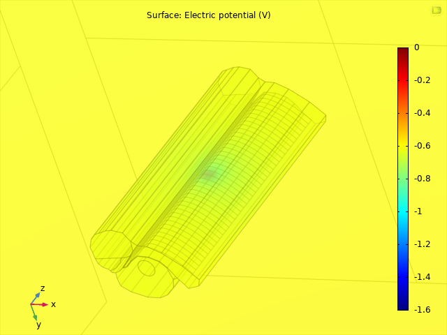
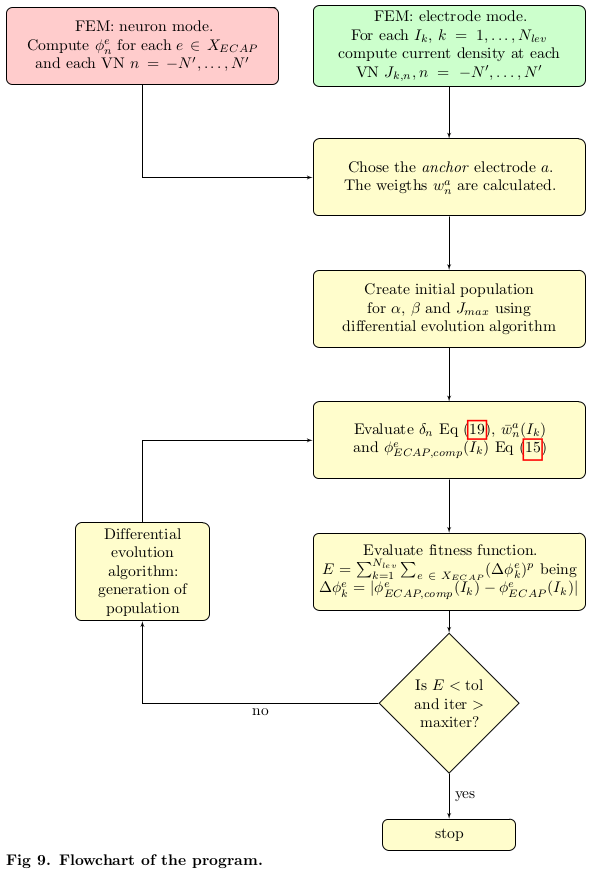

<!-- Version -->
<div></div>
<!-- Licencia y commits -->
<div>
   
   
</div>
<div>
   <a href=""></a>
   <a href=""></a>
   <a href=""></a>
   <a href=""></a>
</div>


# Introduction: CochlearModel

A computational model is customized with real patient data by the neural response telemetry (NRT) amplitude. 

The following framework let the user to predict the behaviour of auditory nerve stimulated by a CI (Cochlear Implant). 

The computational model is divided into two types of FEM models:

<ul>
   <li><b>Electrode mode</b> calculates the current densities that reach to the virtual neurons (VNs) when an electrode is stimulating with 1mA (stationary problem).</li>



<li><b>Neuron mode</b> calculates the potential that reach the electrode when a membrane current intensity is propagated along each neuron.</li>


</ul>

After that, the **differential evolution (DE)** algorithm adjusted the parameters (FVr_x = [&alpha;, &beta;, Jmin, Jmax]) that minimize the error between real and simulated data.

### Flowchart

The next flowchart shows a summary of the model:


# Getting started

## Prerequisites
<div>
   <a href=""></a>
   <a href=""></a>
   <a href=""></a>
</div>
This framework needs COMSOL Multiphysics®, Matlab® and the COMSOL MATLAB api (LiveLink™).
The code was tested for the following version of the software aforementioned. 

- COMSOL Multiphysics® version 5.6
- Matlab® R2021a
- COMSOL plugging LiveLink™ Matlab® for COMSOL 5.6

## Installation

Clone the repo

```sh
git clone https://github.com/IUSIANI/CochlearModel.git
```

or download <a href="www.github.com/IUSIANI/CochlearModel/archive/refs/heads/main.zip">here</a>

## How to use

The main file is **``Rundeopt.m``**. The initial parameters for the *model* or the *differential evolution* (DE) are in the **``Modelconfig.m``** and **``DEconfing.m``** files respectively.

## Folders explanation

- **./bases/**: save the potential **V** reaching the electrodes (from Neuron Mode) and/or the current density at neurons **J** (from Electrode Mode) when the electrode is stimulating with 1mA, in a ``.mat`` file. It allows us to save time by loading the model results.

- **./comsol/**: contains usefull matlab functions ``.m``  used in this framework for creating the **comsol model** (geometry, material, mesh, phisics, solution, results ...), the **differential evolution** (DE), make custom **plots** or some **utils** functions. The ``init.m`` file initilize the aforementioned folders, define global variables and assign output files in folders.

- **./currentInputs/**: contains the current membrane (WB, bEIF...) in ``.csv`` for different inputs. This is used in **Neuron Mode**.

- **./data/**: contains '.m' where clinical data of the patient (Stimulating Electrode, Stimulating Intensity, Neuronal Response) is stored. Moreover, an example of transimpedance matrix from patient 1 is also included.

- **./results/**: Different outputs is stored such as **images**, **comsol models** (``.mph``), **optimizated** params (``.mat``) (FVr_x = [&alpha;, &beta;, Jmin, Jmax]), **tabular data** with the NRT *real* and *simulated* or the *weights* (``.csv|.xlsx``) or the full matlab **workspace** (``.mat``).

## Tested
<div>
   <a href="https://releases.ubuntu.com/18.04/"></a>
   <a href="https://ark.intel.com/content/www/es/es/ark/products/198019/intel-core-i910900x-xseries-processor-19-25m-cache-3-70-ghz.html"></a>
   <a  href="https://www.nvidia.com/content/dam/en-zz/Solutions/design-visualization/productspage/quadro/quadro-desktop/quadro-pascal-p400-data-sheet-us-nv-704503-r1.pdf"></a>
   <a  href=""></a>
</div>

The code was tested over the following conditions:

- OS: <a href = "https://releases.ubuntu.com/18.04/">Ubuntu 18.04.6 LTS</a>

- CPU: <a href="https://ark.intel.com/content/www/es/es/ark/products/198019/intel-core-i910900x-xseries-processor-19-25m-cache-3-70-ghz.html">Intel (&reg;) Core (&trade;) i9-10900X</a>

- DRAM: 128Gb DDR4

- GPU: <a href="https://www.nvidia.com/content/dam/en-zz/Solutions/design-visualization/productspage/quadro/quadro-desktop/quadro-pascal-p400-data-sheet-us-nv-704503-r1.pdf">NVIDIA Quadro P400</a>


### Elapsed Times:

- **Neuron** Mode (Comsol) ≈ 1h 15 min

- **Electrode** Mode (Comsol) ≈ 15 min

- Differential Evolution (**DE**) Algorithm ≈ 2 min

- **Total** elapsed time ≈ 1h 30min 

<!-- # Cite as
Ramos, A., Escobar, J., Greiner, D., Rodríguez, E., Oliver, A., Hernández, M., & Ramos, A. (2022). A phenomenological computational model of the evoked action potential fitted to human cochlear implant responses. *PLOS Computational Biology*.

#### Bibtex

@article{Ramos2022,
 author = {Ramos, A., Escobar, J.M., Greiner, D., Ben'itez, D., Rodr'iguez, E., Oliver, A., Hern'andez M. Ramos, A.},
 title = {A phenomenological computational model of the evoked action potential fitted to human cochlear implant responses},
 journal = {PLOS Computational Biology},
 year = 2022,}
 -->

# License 
<a href="/docs/LICENSE"></a>
Distributed under the MIT License. See ``LICENSE.txt`` for more information.

# Disclaimer
<a href="/docs/DISCLAIMER"></a>
See ``DISCLAIMER.txt`` for more information.

# Acknowledgments
<a>
   
   
</a>

This work has been supported by Ministerio de Ciencia, Innovación y Universidades, Gobierno de España, grant contract: PID2019-110185RB-C22 and Agencia Canaria de Investigación, Innovación y Sociedad de la Información, Consejería de Economía, Conocimiento y Empleo del Gobierno de Canarias and European Regional Development Funds (ERDF/FEDER), grant contract: PROID2020010022.
